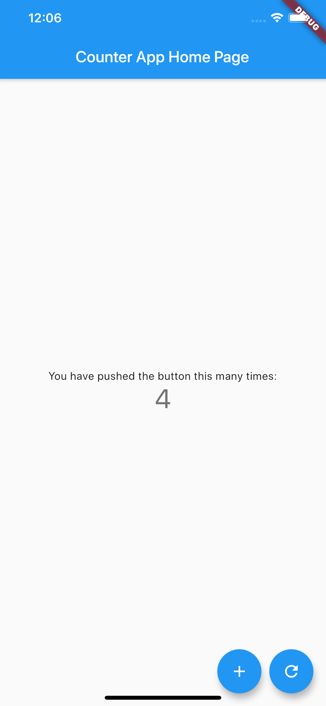

= A Working Example

Once completed, this is intended to be a full working example
of using Ogurets, Flutter for Mobile, Flutter for Web, the OpenAPi generator for Dart and Java,
a Java server, e2e tests for api, and a video and documentation series.

== Prerequisites: 

Java 11+.

Maven (optional if running mvn commands)

Flutter SDK

Docker 

== authors

- _Richard Vowles_, Software Developer (https://www.linkedin.com/in/richard-vowles-72035193/)

== Counter Example

This is an extension of the Counter example that comes with flutter. The api simply adds a reset, increase and get
api.

== folders

- api - holds the OpenAPI specification yaml file for the back-end Counter service.
- java-server - holds the java server code
- example_mobile_client - holds the flutter client
- dart_e2e - holds the e2e tests for the back-end service written in Dart and using Ogurets - Cucumber for Dart package
- dart_api - holds the generated code for the e2e client

==== Building the java server

You can build it as a Docker image:

----
cd java-server
mvn -Pdocker clean package
docker load -i target/jib-image.tar
docker-compose up
----

It will be running on port 8076, and you can check this with a curl:

----
curl -v http://localhost:8076/counter
----

=== Generate client API code to be used by Flutter app and back-end e2e tests

----
cd dart_api 
----

run the following command to generate client code with Open API Dart codegen plugin

----
java -cp openapi-generator-cli-4.2.1.jar:openapi-dart-generator-2.2.jar org.openapitools.codegen.OpenAPIGenerator generate -i ../api/src/main/resources/counter.yaml — additional-properties pubName=counterapi -g dart2-api — enable-post-process-file
----

alternatively if you have maven installed you can run

----
mvn clean generate-sources
----

to install dart dependencies run

----
pub get
----

=== Building and running Flutter app

----
cd example_mobile_client
pub get
flutter run
----

=== Running back-end e2e tests with Ogurets - Cucumber for Dart

----
cd dart_e2e
pub get
dart --enable-asserts tests/ogurets_run.dart
----

=== Running Flutter mobile e2e tests with Ogurets - Cucumber for Dart

Launch iOS or Android emulator

----
cd example_mobile_client
pub get
dart --enable-asserts test_driver/ogurets_flutter_test.dart
----

note, one scenario should fail for demo purposes of an error case 

read more on Ogurets-Cucumber for Dart here https://github.com/dart-ogurets/Ogurets

There are a few deliberate design decisions here, it is only an example and certainly not one we would run
in a production scenario. It is missing:

- an api lifecycle to shutdown the server
- healthcheck endpoints
- proper jersey configuration for exception handling, bean validation, logging and tracing
- proper logging infrastructure that is k8s aware

